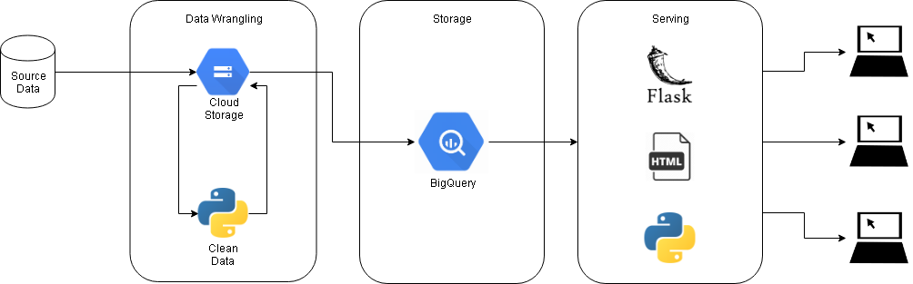

# Sample: Full stack data pipeline
In this sample, I took advantage of the free trial in Google Cloud Platform

## Data Flow

** figure 1: data flow used **

## Pre-requisites
1. Installation of Python 3.7 in local desktop
2. Installation of Google Cloud SDK in local desktop

## Data Pre-processing
1. Import ```./data_cleaning/*``` in ```${HOME}``` of Google Cloud Shell
2. Import GPG-encrypted file in Google Cloud Storage ```gs://bucket-name/data```
3. Execute ```./data_cleaning/start.py```
	- Copy GPG-encrypted file from GCS to Cloud Shell
	- Decrypt file
	- Clean timestamp column
	- Drop null users
	- Save as CSV and copy back to GCS output directory

## Database Loading in BigQuery (Done in GCP console)
1. Create dataset
2. Create external table pointing to the GCS output directory

## Deployment
1. Locally develop scripts found in ```./app```
2. Deploy to GCP App Engine using ```gcloud app deploy```
3. Output can be found here -- [JA] url is dead as of today 2020-01-22

## Improvements that can be done
1. Automate and schedule file checking from source GCS bucket so that new data can be added
2. Improve HTML display
3. Add aggregations in the front-end instead of just a per-user filtered view
4. Code improvements
